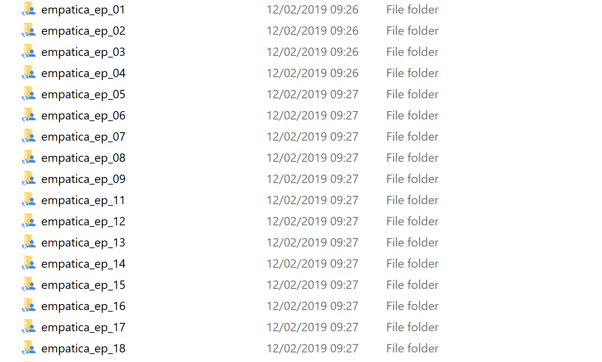

# pythonDataInterpeter
Toolbox for the data interpretation
# How to use
- All the code is executed from executer.py. No other class is needed.
- executer.py also contains description of what does what
- For the plot methods, the parts of the pss are needed as csv files. Downloaded and split into the specific parts. Also see PssPlotsCreater.py for more info
- Before any of the physiological analysis can be performed the splitAllFiles() method in the executer has to be executed. This method creates all the files.

##Base Folder
The executer needs a basefolder which contains all the empatica data.
The folder structure should look like this:

So all folders containing empatica data need to follow this naming 
convention: /empatica_ep_0X  Example: empatica_ep_01 or empatica_ep_10

